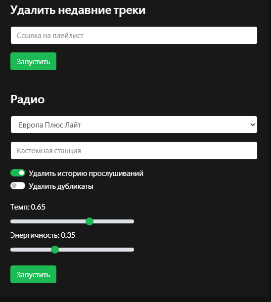

# Add-ons

Useful extensions of the main functions

### Mobile Control

Allows you to manually run functions without triggers and editor. Including passing arguments.

All details [in the topic](https://github.com/Chimildic/goofy/discussions/9).

### Import Tracks from Radio

Allows you to import tracks from FM and internet radio.

Several options. The choice depends on which station you need:

- [the-radio](https://github.com/Chimildic/goofy/discussions/35)
- [pcradio](https://github.com/Chimildic/goofy/discussions/60)
- [AudioAddict](https://github.com/Chimildic/goofy/discussions/57) (di.fm and others)
- [Radio Paradise](https://4pda.to/forum/index.php?s=&showtopic=715234&view=findpost&p=105313450)

?> If you can't find the desired station or want another source, write [on the forum](https://github.com/Chimildic/goofy/discussions)

### Recommendations from the Past

For Last.fm users. [The topic](https://github.com/Chimildic/goofy/discussions/91) describes an example of using the [getCustomTop](/reference/lastfm?id=getcustomtop) function, which creates the `Memory Pool` playlist consisting of good but forgotten tracks.

### Listening Skips

[This method](https://github.com/Chimildic/goofy/discussions/53) is based on reading files that Spotify creates locally on the device. Thus giving access to tracks that were quickly skipped and did not fall into the visibility zone of the [main history collection mechanism](/details?id=История-прослушиваний).

### New Releases

Imports tracks of the selected genre from the [Every Noise](https://everynoise.com/new_releases_by_genre.cgi) website. Description [in the topic](https://github.com/Chimildic/goofy/discussions/36).

?> To get releases of tracked artists, use the [getArtistsTracks](/reference/source?id=getartiststracks) function with the `release_date` parameter

### Other

Even more examples are described [on the forum](https://github.com/Chimildic/goofy/discussions) under the _personal experience_ category.
