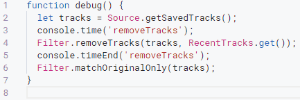

# Useful Experience

Tips for working with goofy and Apps Script

## Branching Algorithm

An algorithm does not have to be linear. If for some reason the playlist does not need to be updated, the function can be terminated.

Suppose there is a daily playlist that does not need to be updated on Wednesdays. To implement this, we will write a condition check. This will create a branch in the code.

?> Read more about the `if` condition [here](https://itchief.ru/javascript/сonditional-and-logical-operators)

The keyword `return` is used to return a value from a function. Code after this command is never executed. Using `return` without a return value is a special case, the receiving side will get an `undefined` value. In the case of a trigger run, this is simply equivalent to the function ending.

The example demonstrates that if today is Wednesday, the function terminates. The code after `return` will not be executed. But if today is another day of the week, execution will not enter the `if` branch, meaning it will not execute the `return` command, and will proceed further to the playlist update logic.

```js
if (Selector.isDayOfWeek("Wednesday")) {
  console.log("Today is Wednesday. The playlist will not be updated.");
  return;
}

// Playlist update logic
let tracks = Source.getPlaylistTracks("", "id");
// ...
```

Another situation. We have a playlist with 40 tracks. We listen to it periodically. Let's add some branching depending on the number of listened tracks. For example, if less than or equal to 10 tracks are listened to, update all tracks. From 10 to 40 (exclusive), remove the listened tracks from the playlist. If there are 40 tracks, do not touch the playlist.

```js
const ID_TARGET = "id result";

let tracks = Source.getPlaylistTracks("", ID_TARGET);
Filter.removeTracks(tracks, RecentTracks.get());

if (tracks.length == 40) {
  return;
} else if (tracks.length > 10 && tracks.length < 40) {
  Playlist.saveWitUpdate({
    id: ID_TARGET,
    tracks: tracks,
  });
} else {
  Playlist.saveWithReplace({
    id: ID_TARGET,
    tracks: Source.getPlaylistTracks("", "id result"),
  });
}
```

## Debugging

Debugging allows you to stop code execution at any point and analyze the values at that moment.

For example, you need to get all track names. But what is the key for this field: `title`, `name`, `label`, `trackname`? Iterating through them is long and inconvenient. By debugging, you will see all available keys for the track and other elements.

?> Spotify documentation is available [here](https://developer.spotify.com/documentation/web-api/reference/)

Set a breakpoint by clicking next to the line number, select the function, and click `debug`.


As a result, the debugger will open on the right, where you can view intermediate variable values and continue execution step by step. There are 4 buttons at the top: run (to the next breakpoint or to the end), step over, step into, and step out. Try it yourself to understand it in practice.


When running a function through a trigger, various information might be needed. For example, the number of tracks before and after filters. To output such messages, use the `console.log` function.

```js
let tracks = Source.getSavedTracks();
console.log("Number of favorite tracks", tracks.length);
```


To solve the task of getting track names, output them as follows:

```js
let tracks = Source.getSavedTracks();
tracks.forEach((track) => console.log(track.name));
```

Additionally, [hotkeys](https://github.com/Chimildic/goofy/discussions/112) for quick navigation to the function description directly from the code editor can be useful.

## Multiple Accounts

One Google account (Apps Script) can manage multiple Spotify accounts (starting from goofy version 1.6.1).

To set up goofy for an additional Spotify account, repeat the [installation](https://ladywhiskers.github.io/Spotify-Playlist-Helper/#/install) steps, but:

1. Copy the goofy project as you did in [step 4 of the installation](https://ladywhiskers.github.io/Spotify-Playlist-Helper/#/install).
2. Use the same `CLIENT_ID`, `CLIENT_SECRET`, `PRIVATE_CLIENT_ID`, `PRIVATE_CLIENT_SECRET` values in the _config_ file (i.e., skip steps 1-2).
3. When granting access rights in step 10, log in through the new Spotify account.

Now you have two goofy projects: the main one and a copy. Each is authorized under different Spotify accounts. Projects can interact with each other:

- Shared drive. Using the [file path](/best-practices?id=Путь-до-файла), the [Cache](/reference/cache) functions can work with files from other folders. By default, each project writes files to a folder with the account id. This means you can update files in one project and read them in another.
- By performing additional steps, you can call functions in the copy project while being in the main project. A function launched this way will use the token of the account in which the project is located.

### Managing the Copy

1. Go to the settings of the copy project and copy its identifier.


2. Now go to the main project. Click the plus button next to the word `libraries`. Paste the project identifier from the first step and specify a readable name in the library identifier field. For example, the nickname of the second Spotify account.


3. For the main project to use functions from the copy project, you need to create public functions in the copy. Usually, this is just a wrapper around a goofy function. It is important to specify the return result `return` and repeat the input arguments (sometimes there are more than one, refer to the documentation).

```js
// copy project
function saveWithReplace(data) {
  return Playlist.saveWithReplace(data);
}

function getFollowedTracks(params) {
  return Source.getFollowedTracks(params);
}

function getSavedTracks(limit) {
  return Source.getSavedTracks(limit);
}

function getUserId() {
  return User.id;
}
```

Now you can call `CopyGoofy` to invoke functions.

```js
// main project
function example() {
  // Tracks from the main account
  let followedTracksFirstAccount = Source.getFollowedTracks({
    type: "followed",
  });
  // Tracks from the copy account
  let followedTracksSecondAccount = CopyGoofy.getFollowedTracks({
    type: "followed",
  });

  // Create a playlist under the main account
  Playlist.saveWithReplace({
    // ...
  });

  // Create a playlist under the copy account
  CopyGoofy.saveWithReplace({
    // ...
  });

  // Due to Apps Script limitations, the following syntax is not possible. Hence, wrapper functions are created.
  // Error: CopyGoofy.Playlist.saveWithReplace()
}
```

The main account can also read files directly from the copy's folder.

```js
// main project
Cache.read(`root/${CopyGoofy.getUserId()}/filename.json`);
```

```js
// copy project
function saveWithReplace(data) {
  return Playlist.saveWithReplace(data);
}

function getFollowedTracks(params) {
  return Source.getFollowedTracks(params);
}

function getSavedTracks(limit) {
  return Source.getSavedTracks(limit);
}

function getUserId() {
  return User.id;
}
```

Now you can call `CopyGoofy` to invoke functions.

```js
// main project
function example() {
  // Tracks from the main account
  let followedTracksFirstAccount = Source.getFollowedTracks({
    type: "followed",
  });
  // Tracks from the copy account
  let followedTracksSecondAccount = CopyGoofy.getFollowedTracks({
    type: "followed",
  });

  // Create a playlist under the main account
  Playlist.saveWithReplace({
    // ...
  });

  // Create a playlist under the copy account
  CopyGoofy.saveWithReplace({
    // ...
  });

  // Due to Apps Script limitations, the following syntax is not possible. Hence, wrapper functions are created.
  // Error: CopyGoofy.Playlist.saveWithReplace()
}
```

The main account can also read files directly from the copy's folder.

```js
// main project
Cache.read(`root/${CopyGoofy.getUserId()}/filename.json`);
```

## Command Palette

The command palette is a list of actions available to the code editor. Here are some useful ones.

Place the cursor on any line of code and press <kbd>F1</kbd> or right-click to open the context menu and select the palette. At the top, there is a search field for quick command lookup. Hotkeys, if available, are shown to the right of the command name. For example, type `font`.


- Quick Copy. Place the cursor anywhere in the line. Hold down <kbd>Shift</kbd><kbd>Alt</kbd> and press <kbd>↓</kbd>. The same effect occurs with a selected code fragment.

  

- Vertical Selection. Place the cursor in the desired location. Hold down <kbd>Shift</kbd><kbd>Alt</kbd> and drag the mouse to the opposite corner.

  

- Vertical Selection without Mouse. Use the arrow keys to reach the desired position. Hold down <kbd>Ctrl</kbd><kbd>Alt</kbd> and press the up or down arrow. Then hold down <kbd>Ctrl</kbd><kbd>Shift</kbd> and press the left or right arrow.

  

- Rename. Select a word, such as a variable, and press <kbd>F2</kbd>. All mentions will change to the new name.

  

- Move Line. Place the cursor anywhere in the line. Hold down <kbd>Alt</kbd> and press the up or down arrow. Similarly for selection.

  

- Comment Action. Place the cursor anywhere in the line and press <kbd>Ctrl</kbd><kbd>/</kbd>, the line will be commented. Pressing again will remove the comment. Similarly for a selected fragment.

  For multi-line comments, use the combination <kbd>Shift</kbd><kbd>Alt</kbd><kbd>A</kbd>

  

- The combination for quick formatting is <kbd>Shift</kbd><kbd>Alt</kbd><kbd>F</kbd>
- Collapsing and expanding all code can also be useful. There is no combination, look for it in the palette.

## Finding Values

There are several ways to find the value of an element. For example, the genres of an artist or the minimum energy threshold of a track.

### Spotify Console

The simplest way is the Spotify console. An add-on that calls API methods with specified parameters.

1. Go to the [console](https://developer.spotify.com/console/) and find the necessary API method. For example, [artist by _id_](https://developer.spotify.com/console/get-artist/).
2. A token is needed to make a request. Click the `get token` button. In the opened list, pay attention to the note `not require a specific scope`. If it is there, just click the `request token` button. Otherwise, check the checkboxes below the note. Do not touch the large list at the bottom.
3. Add the artist's _id_ in the field and click the `try it` button.

The response on the right will show all available attributes of the artist. For example, genres. Use them in [rangeTracks](/reference/filter?id=rangetracks) for `genres` or `ban_genres`

```js
"genres": [
  "candy pop",
  "emo",
  "pixie",
  "pop emo",
  "pop punk"
]
```

### Step-by-Step Debugging

A less convenient way. It largely depends on what data needs to be found.

[While debugging](/best-practices?id=Выполнение-отладки), set a breakpoint after the line of interest. For example, after getting the list of artists. The debugger will show an array of elements. It is inconvenient to search for a specific artist's value there.


### Logging

Elements are iterated in a loop, and the necessary information is logged. Not suitable for finding data hidden inside the library. For example, [track features](/reference/desc?id=Особенности-трека-features) are not directly returned, and functions to get them are undocumented. Naturally, modifying the library code is allowed, but this method is not reflected here.

```js
// Artist and their genres
artists.forEach((a) => console.log(a.name, a.genres));

// List of: artist - track
console.log(tracks.map((t) => `${t.artists[0].name} - ${t.name}`).join("\n"));
```

## Advanced Trigger

In the [trigger economy](/best-practices?id=trigger-economy) section, a method of reducing triggers by combining functions with **similar schedules** is described. For example, updating daily playlists. Instead of the "1 trigger = 1 function" scheme, switch to "1 trigger = 2+ functions". This section describes the "1 trigger = all functions" method, regardless of schedule similarity.

As an illustration, the `runTasks_` function. It is activated by one trigger every 15 minutes but performs three functions (tasks) at different times thanks to the Clerk: updating the listening history every 15 minutes, adding new likes to the cache daily, and rewriting the likes cache weekly in case tracks are deleted.

The Clerk is a software module `Clerk` with two functions:

- `runOnceAfter` - perform a task once a day after a specified time of day.
- `runOnceAWeek` - perform a task on a specific day of the week after a specified time of day.

Function descriptions in the [documentation](/reference/clerk)

### Example Analysis {docsify-ignore}

According to the comments:

1. A trigger is set to run every 15 minutes for the `runTasks_` function.
2. The `RecentTracks.update()` function runs every 15 minutes without additional conditions or checks.
3. Time condition check. If the `updateSavedTracks` function has run, `isUpdatedSavedTracks` contains `true`; otherwise, it has not run and contains `false`.
4. If the `updateSavedTracks` function has not run, the `appendSavedTracks` function runs at the specified time; otherwise, it does not run.

```js
// Trigger: every 15 minutes (1)
function runTasks_() {
  RecentTracks.update(); // runs every 15 minutes (2)
  let isUpdatedSavedTracks = Clerk.runOnceAWeek(
    "monday",
    "01:00",
    updateSavedTracks
  ); // (3)
  !isUpdatedSavedTracks && Clerk.runOnceAfter("01:00", appendSavedTracks); // (4)

  function updateSavedTracks(tracks) {
    // runs every Monday after 1 AM
  }

  function appendSavedTracks() {
    // runs every day after 1 AM
  }
}
```

## Hiding Functions

There are two ways to hide functions. Such a function cannot be run directly in the code editor and is not available for triggers.

The first way is useful for reducing the list of selectable functions when creating a trigger. Additionally, an example of its use is in the [trigger economy](/best-practices?id=trigger-economy).

Add an underscore at the end of the name. In the example, the `create` function is available to run, but `update_` is not.

```js
function create() {}

function update_() {}
```

- This way, the `runTasks_` function is hidden (the trigger for it is created programmatically).
- It is not recommended to hide the `doGet` function. It is needed for authorization and [mobile management](/addon?id=Управление-с-телефона).
- The `setProperties` function can be hidden this way. But if you need to update the parameters, you should revert to the regular name to enable running it in the editor.

The second way is useful for isolating repetitive blocks. For example, when different sources require the same set of filters.

JavaScript allows defining a function inside another function, thereby reducing its scope. In the example, the `get` function is available for calls inside `append` but not visible inside `update`.

```js
function update() {}

function append() {
  function get() {}
}
```

## Request Economy

Apps Script provides a daily quota of 20,000 requests. When this limit is reached, it becomes impossible to fetch tracks or modify playlists. The exact time of quota reset is unknown.

Functions that make many requests in a single call have a corresponding note in [their description](/reference/index). Simpler functions can also consume more than expected. The main reason is the number of tracks. For example, fetching 1,000 favorite tracks requires 10 requests, while 10,000 tracks require 100 requests. This is a small amount for one day, so implementing a caching mechanism via `Cache` is unnecessary. However, logical errors can easily occur.

?> Reducing the number of requests saves quota and execution time.

Suppose you need to remove favorite tracks from the source and randomly select ten favorite tracks for a playlist.

```js
// Correct version
let topTracks = Source.getTopTracks("long");
let savedTracks = Source.getSavedTracks();

Filter.removeTracks(topTracks, savedTracks);
Selector.keepRandom(savedTracks, 10);
```

Several mistakes can be made. These examples are not fictional; they have been found in user algorithms.

```js
// Not creating a variable for savedTracks
// Error: fetching the same tracks twice
Filter.removeTracks(topTracks, Source.getSavedTracks());
let tracks = Selector.sliceRandom(Source.getSavedTracks(), 10);

// Calling Selector before Filter
// Error: not all tracks will be removed from topTracks (unless this is intentional)
Selector.keepRandom(savedTracks, 10);
Filter.removeTracks(topTracks, savedTracks);

// Trying to fix the previous error
// Error: extra requests again
Selector.keepRandom(savedTracks, 10);
Filter.removeTracks(topTracks, Source.getSavedTracks());
```

1. When the algorithm requires the same set of elements, try changing the order. As shown in the _correct version_ above, use the full set wherever needed and only then modify it.
2. If this is not possible, create a copy instead of making new requests.

```js
let savedTracks = Source.getSavedTracks();
let copySavedTracks = Selector.sliceCopy(savedTracks);
```

The `getCountRequest` function returns the number of requests made from the start of execution to the function call. The value is not cached and resets to zero with each run. Add the following line of code at the end of your function to compare the quality of your optimization.

```js
console.log("Number of requests", CustomUrlFetchApp.getCountRequest());
```

Consider the impact of functions that can select a _random_ number of elements. For example, each artist has a different number of albums, which will affect the number of requests made with each new run.

## Trigger Economy

According to the [limitations](/details?id=limitations), each project (library copy) is limited to 20 triggers. One of these is always used for updating the listening history.

Suppose there are 3 daily playlists. Each function is called by a separate trigger.

```js
function createSavedAndForgot() {}

function createDailyMix() {}

function createRecom() {}
```

If the execution time is not critical, we can combine these functions, thus saving 2 triggers.

- [hide the functions](/best-practices?id=hiding-functions)
- delete the previous triggers
- create a new trigger for the combined function `createEveryDayPlaylists`

```js
function createEveryDayPlaylists() {
  createSavedAndForgot_();
  createDailyMix_();
  createRecom_();
}

function createSavedAndForgot_() {}
function createDailyMix_() {}
function createRecom_() {}
```

?> It is important to monitor another limitation - execution time (6 minutes). For proper operation, the combined functions' total execution time should not exceed this limit.

## Google Drive

### File Path

Starting from version 1.6.1, creating files in folders is supported. All data is still placed in the root `Goofy Data` folder. Scripts from previous versions do not require changes.

The created folders are divided into two types:

- _Account folders_. Automatically created in the root with the name of the Spotify account _id_.
- _Custom folders_. Created by you when using the [Cache](/reference/cache) module.

?> The described examples of working with folders are valid for all `Cache` functions.

Example 1 - To create a file, specify only the name. It will be located in the _account folder_.

```js
Cache.write("MySavedTracks.json", []);
```

Example 2 - To create a _custom_ folder, specify in the string: the folder name, a slash `/`, and the file name. Below is an example of creating the `example.json` file in the `test` folder, which will be placed in the _account folder_.

```js
Cache.write("test/example.json", []);
```

Example 3 - A new _custom_ folder can be created in the root of `Goofy Data`. To do this, specify the reserved word `root` and add a slash `/`. Below is an example of creating the `example.json` file, which will be located in the `shared` folder in the root of `Goofy Data`.

```js
Cache.write("root/shared/example.json", []);

// Similarly
Cache.write("../shared/example.json", []);
```

Example 4 - If you do not want to get confused about locations, explicitly specify the reserved words `root` and `user` to distinguish the start of the path.

```js
// The shared folder in the root of Goofy Data
Cache.write("root/shared/example.json", []);
Cache.write("../shared/example.json", []);

// The myfolder folder in the account folder
Cache.write("user/myfolder/example.json", []);
Cache.write("./myfolder/example.json", []);
```

Example 5 - Folder nesting is not limited.

```js
Cache.write("root/shared/radio/rock/lastfm.json", []);
Cache.write("user/private/radio/pixie.json", []);
```

Example 6 - If you have multiple Spotify accounts using goofy projects on one Google account, you can create _shared files_. For instance, one project collects tracks for a radio and saves them in a shared folder, while the second account simply reads this file without spending time on the same search.

?> You cannot place a file in the root `Goofy Data` folder. They will always be moved to the account folder. This is done so that most users do not have to manually change the Drive structure. Be sure to specify at least one folder that will be at the same level as the account folders.

```js
// The first project writes to the file
Cache.write("root/shared/myradio.json", []);

// The second project reads it
let radioTracks = Cache.read("root/shared/myradio.json");
```

### Version Control

Files from [Cache](/reference/cache) are stored on [Google Drive](https://drive.google.com/), including the [listening history](/details?id=Listening-History). A deleted file goes to the trash, where it is available for another 30 days. Each file can have up to 100 versions. Each write to the same file creates a new version.

To revert to a previous version of a file:

1. Go to the `Goofy Data` folder on [Google Drive](https://drive.google.com/)
2. Right-click on the file and select `manage versions`
3. Find the version by the modification date and download it from the three-dot menu
4. In the same window, click the `upload new version` button and select the previously downloaded file

?> When reverting the listening history, do not leave an empty file. It should contain at least an empty array `[]`.

## keep and slice

Among the `Selector` functions, there is a group that starts with the words `keep` and `slice`. When should you use each?

The difference lies in the absence or presence of a return value:

- The `keep` group calls the `replace` function internally, thereby replacing the elements of the original array with new ones.
- The `slice` group does not modify the original array. A new array is created and returned as a result.

```js
// This code
let tracks = Source.getTopTracks("long");
tracks = Selector.sliceFirst(tracks, 10);

// Is equivalent to this
let tracks = Source.getTopTracks("long");
Selector.keepFirst(tracks, 10);
```

Then why do we need two groups? Depends on the context of use. With `keep` the code looks cleaner. No constant equating to the same variable

`slice` functions are useful for combining:

```js
// Selection in one line
let tracks = Selector.sliceRandom(RecentTracks.get(), 100);

// Selection before updating the playlist
Playlist.saveWithReplace({
  // ...
  tracks: Selector.sliceFirst(tracks, 50),
});
```
