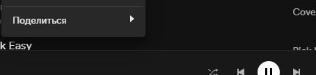

## Main Pages
- [My Projects](https://script.google.com/home/my) - a list of projects on your account, selecting a project opens the _code editor_
- [Executions](https://script.google.com/home/executions) - contains a list of _results_ of executed functions
- [Triggers](https://script.google.com/home/triggers) - schedule for executing functions

## Creating a Playlist

Let's complete the following task:
- take tracks from the `Absolute Bangers Collection` playlist and the `Spotify All-Time Top 100` playlist
- remove favorite tracks (likes) from them
- add recommendations
- create a playlist
- set a schedule (trigger)

1. Open the `main` file in the _code editor_ and paste the following code into it and __save__ (disk icon or <kbd>Ctrl</kbd><kbd>S</kbd>):
```js
function createFirstPlaylist() {
    // 1 - gather
    let mixTracks = Source.getTracks([
        { name: 'Absolute Bangers Collection', id: 'PLAYLIST_ID' },
        { name: 'Spotify All-Time Top 100', id: 'PLAYLIST_ID' },
    ]);
    let recomTracks = Source.craftTracks(mixTracks);
    let savedTracks = Source.getSavedTracks();   

    // 2 - process
    Combiner.push(mixTracks, recomTracks);   
    Filter.removeTracks(mixTracks, savedTracks);
    Selector.keepRandom(mixTracks, 20);
    
    // 3 - create playlist
    Playlist.saveWithReplace({
        // id: 'yourId',
        name: 'First Playlist',
        tracks: mixTracks,
        randomCover: 'update',
    });
}
```

2. The logical structure of the code consists of three blocks. First, tracks are requested. Then operations are performed on them. Finally, the command to create a playlist with the resulting set of tracks is issued.
   
   Think of each line as a command to do something. Such commands are called _functions_. A function can be _defined_ (created) and _called_. That is, set an algorithm and execute it on our request. In this case, the `createFirstPlaylist` function is created, which calls the functions of the Goofy library inside itself. The set of commands (function calls) forms the code.

   To understand what the code does, just read it like a book. Each word has a definition in the dictionary. Similarly, each function has a description of what it does. Often the main meaning is conveyed by the function name itself. Therefore, knowledge of English or the use of a translator will help a lot. However, there are always nuances: what to pass to the function, what it will do, what it will return?

   Function descriptions are available in the _function list_. For example, let's find the description of the `Source.getTracks` function. In the left menu, right-click on the `module list` item and open the page in a new tab. Go to this tab and find `Source`, then `getTracks`. We will see the description and usage examples.

3. The code will currently run with an error because the `id` of the `daily mix` playlists is not set.
   
   To get the `id`, you need to go to the playlist page on Spotify and click `share`. This will give us a link to the playlist. From it, you need to extract the `id`.

   > If you open the `share` menu and press the `Alt` button, Spotify will offer to copy the URI instead of the link.

   

   Go to [this page](/reference/desc) in a new tab to see how to extract the `id` from the link or URI.

   Go to the `Daily Mix` playlist page (Search section - For You - Daily Mix), copy the link, paste it into the code, and remove all unnecessary parts, leaving only the `id`. Repeat for the second playlist.

   As a result, you will get the following:
   ```js
   let mixTracks = Source.getTracks([
        { name: 'Absolute Bangers Collection', id: '08ZBip1gxb97iNoHjFEBYh' },
        { name: 'Spotify All-Time Top 100', id: '5AFTprIryCRYJeR4TUFNAM' },
   ]);

   // Errors!
   // { name: 'Daily Mix 1', id: 'https://open.spotify.com/playlist/491ZfFnGxaBF445JOhhxiO?si=343F7972b107494a' },
   // { name: 'Daily Mix 1', id: 'spotify:playlist:426ZfFnGxaBF445JfOJefE' },
   ```
   
4. The rest of the code does not require configuration. In the control panel, select our function and click `run`.
   
   

   > You may see an error with number 500. Ignore it. Sometimes Spotify responds poorly to recommendation requests.

5. Go to Spotify. You now have a playlist named `First Playlist`. It does not contain liked tracks. Some tracks come from recommendations, and some from daily mixes. This uncertainty is intentional. Because the `Selector.keepRandom` function is called in the code, which randomly selects the specified number of tracks.

   Find the line with the `Combiner.push` function in the code. And put `//` at the beginning of the line.

   ```js
   // Combiner.push(mixTracks, recomTracks);
   ```
   
   You have _commented out_ the line. Any text after the `//` symbols is ignored and will not be executed.
   
   Now find the lines `let recomTracks` and `Selector.keepRandom` - comment them out too.
   
   What did you do? Stopped requesting recommendations, so we don't combine them with tracks from mixes and removed the random selection.

6. Run the function again. Now the `First Playlist` will only contain tracks from the `daily mixes`, with likes removed.
   
   Note that a new playlist was not created, but the existing one was updated. Thanks to the `Playlist.saveWithReplace` function.
   
   However, there is an important nuance. The function searched among your playlists by the name `First Playlist` to get the `id` and send requests to add tracks. Theoretically, there may be several playlists with the __same__ names in your library. The search will not be able to determine which specific playlist you want to add tracks to. Therefore, it will take the first one it finds. This can be undesirable, leading to an error, updating the wrong playlist.
   
   To avoid this, after the first run of the function, return to the code to explicitly specify the `id` of the playlist. That is, go to the playlist page, copy the link, and paste the `id` into the code. Where? In the list of function arguments related to creating the playlist.
   
   In our example, you need to remove the comment sign `//` from the `id` and insert the value itself:
   ```js
   // Was
   Playlist.saveWithReplace({
       // id: 'yourId',
       name: 'First Playlist',
       tracks: mixTracks,
       randomCover: 'update',
   });

   // Became
   Playlist.saveWithReplace({
       id: '476ZfFnGxaBF4В5JАhhxiO',
       name: 'First Playlist',
       tracks: mixTracks,
       randomCover: 'update',
   });
   ```

7. We created the `First Playlist` thanks to the `createFirstPlaylist` function. Now let's learn how to create a schedule for automatically running functions using triggers.
   
   The trigger needs to set the start time. For example, every day at seven in the morning or every Monday. And also the name of the function to be run.

   At the same time, we will touch on the issue of how to create several playlists at once.
   Now you have one function in the `main` file. Add a new function to the _end of the file_ (don't forget to save the file):
```js
function createRandomSavedTracks() {
    let tracks = Source.getSavedTracks();

    Selector.keepRandom(tracks, 5);

    Playlist.saveWithReplace({
        name: 'Random Favorite Tracks',
        tracks: tracks,
    });
}
```

?> Your project has three files. `library` contains the functions of the Goofy library. You use them to create playlists. The `config` file contains settings. Your code is located in `main`. Since you can create (copy) many functions, it makes sense to create new files for logical separation. So that `main` does not accumulate a huge wall of code.

8. In the left menu, select triggers
   
   
   
   The `Add Trigger` button is at the bottom right.
   - Select the `createRandomSavedTracks` function
   - Time-driven trigger
   - Every minute
   - Save

9. Go to Spotify. In a minute, a new playlist will appear, and every subsequent minute its content will be updated with 5 random favorite tracks.

   After checking this, go to the [trigger list](https://script.google.com/home/triggers). You will see two triggers: for the `createRandomSavedTracks` function, created manually earlier, and for the `runTasks_` function, created automatically. Read more about it in [listening history](/details?id=Listening-History).
   
   Delete the trigger for the `createRandomSavedTracks` function: click the three dots on the right, delete the trigger. In the same menu, you can open the execution list (results) of a *specific* trigger.
   
   Go to the [my executions](https://script.google.com/home/executions) section. You will see a general list of completed or ongoing operations, their runtime, completion status, and logs.

## Continuing Work

Above, you got acquainted with the basic principles of work. It is recommended to continue familiarizing yourself through [templates](/template). They show basic techniques for working with the library, which are easier to modify. Especially if you have no programming skills.

Developing your own algorithms should start with describing the idea. What will be the source of the tracks, what operations to perform (get recommendations, filter, etc.), where to save, how often to update. Then find the corresponding functions in the [documentation](/reference/index). Most often these are the `Source`, `Filter`, and `Playlist` modules.

?> [On the forum](https://github.com/Chimildic/goofy/discussions) you can get help with an error and create an algorithm. Always attach your code.

The next step will be optimization. To do this, familiarize yourself with the [limitations](/details?id=Limitations) and [best practices](/best-practices).

Advanced features are available with [addons](/addon). For example, control from a phone.

## Syntax

-  `Function`
   ```js
   function myName(){
        // Function body
   }
   ```

   - The `function` keyword is mandatory.
   - Then an arbitrary name, here it is `myName`.
   - Parentheses `()` for listing arguments (input data). There are no arguments here.
   - Curly braces `{}` define the function boundary.
   - `//` symbols for writing a comment.

- `Variable`
    ```js
    let tracks = 5;
    tracks = 10;
    ```

    - The `let` keyword is mandatory when declaring a variable for the first time.
    - Then an arbitrary name. Here it is `tracks`.
    - `= 5` assigns the value `5` to the `tracks` variable. Assignment is from right to left.
    - The semicolon `;` is optional in this language. But it is recommended to avoid complex errors.
    - On the second line, the value 10 is assigned. The value 5 is lost.

-   Using `function` and `variable`
    ```js
    Module.myName(tracks);
    ```

    - Call the `myName` function from the `Module` and pass the `tracks` variable.

