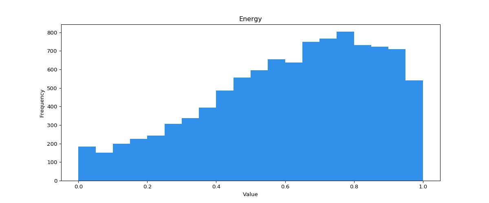
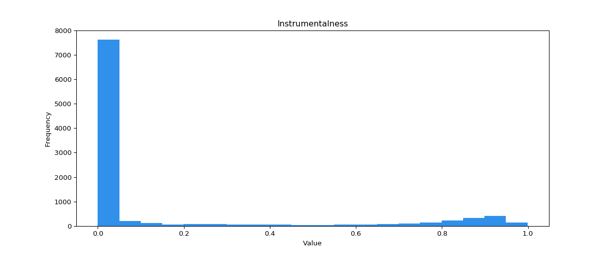
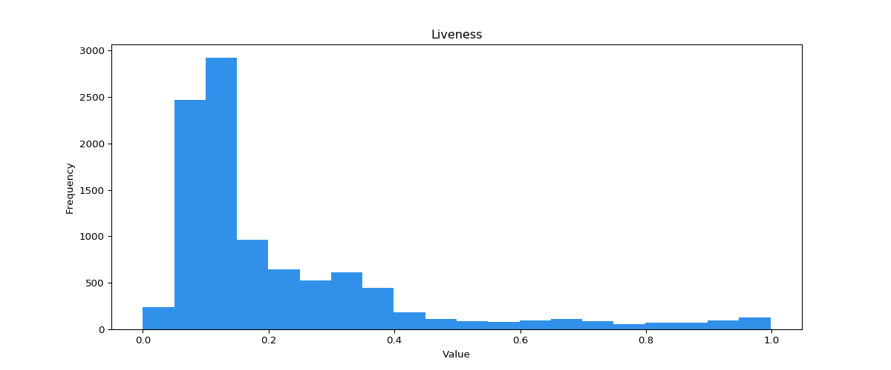
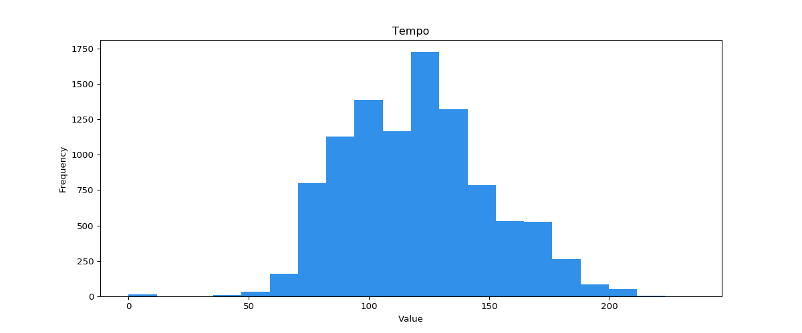

# Helpful Description

## Identifier

The tables below show how to get the identifier from a link or URI.

### Playlist {docsify-ignore}

| id or playlistId | URI | Link |
|-|-|-|
| 5ErHcGR1VdYQmsrd6vVeSV | spotify:playlist:**5ErHcGR1VdYQmsrd6vVeSV** | [open.spotify.com/playlist/**5ErHcGR1VdYQmsrd6vVeSV**?si=123](open.spotify.com/playlist/5ErHcGR1VdYQmsrd6vVeSV) |
| 4vTwFTW4DytSY1N62itnwz | spotify:playlist:**4vTwFTW4DytSY1N62itnwz** | [open.spotify.com/playlist/**4vTwFTW4DytSY1N62itnwz**?si=123](open.spotify.com/playlist/4vTwFTW4DytSY1N62itnwz) |

### User {docsify-ignore}

For old accounts, equal to login. For new accounts, a sequence of letters and numbers.

| userId | URI | Link |
|-|-|-|
| glennpmcdonald | spotify:user:**glennpmcdonald** | [open.spotify.com/user/**glennpmcdonald**](open.spotify.com/user/glennpmcdonald) |
| ldxdnznzgvvftcpw09kwqm151 | spotify:user:**ldxdnznzgvvftcpw09kwqm151** | [open.spotify.com/user/**ldxdnznzgvvftcpw09kwqm151**](open.spotify.com/user/ldxdnznzgvvftcpw09kwqm151) |

## Description of object parameters

The table describes the main keys of Spotify objects in a free translation. The original can be read [here](https://developer.spotify.com/documentation/web-api/reference/tracks/get-audio-features/).

| Key | Range | Description |
|-|-|-|
| `popularity` | 0 - 100 |Popularity of the track, artist or album. The more popular ones are those closer to 100.</br> <ul><li>Track. Calculated based on the total number of plays and how recent they are. A track with a lot of recent plays will be more popular than a track with a lot of old plays. The value may have a lag of several days, i.e. it is not updated in real time.</li> <li>Artist and album. Calculated based on the popularity of the tracks.</li></ul>
| `duration_ms` | 0 - 0+ | Track duration in milliseconds ([calculator](https://www.google.ru/search?ie=UTF-8&q=%D0%BC%D0%B8%D0%BD%D1%83%D1%82%D1%8B%20%D0%B2%20%D0%BC%D0%B8%D0%BB%D0%BB%D0%B8%D1%81%D0%B5%D0%BA%D1%83%D0%BD%D0%B4%D1%8B%20%D0%BA%D0%B0%D0%BB%D1%8C%D0%BA%D1%83%D0%BB%D1%8F%D1%82%D0%BE%D1%80)). Useful for deleting tracks with a short duration by setting a minimum value. Or vice versa, with a long duration.|
| `explicit` | boolean | Presence or absence of profanity. In the case of the [rangeTracks](/reference/filter?id=rangetracks) function, `false` will remove tracks with profanity. `true` or the absence of this key will leave all tracks.
| `added_at` | string | Date the track was added to the playlist in string format. Example of use in the [favorite and forgotten](/template?id=Favorite-and-forgotten) template.
| `genres` and `ban_genres` | array | Artist or album genres. Tests show that the list is always empty for albums. In the case of the [rangeTracks](/reference/filter?id=rangetracks) function, only those tracks will be selected that have at least one genre from the specified `genres` array and none from the `ban_genres` array.
| `release_date` | dates | The period in which the album of the track in question was released, in date format ([the format is described here](/reference/filter?id=rangedateabs)). For example, between 2018 and 2020: `{ min: new Date('2018'), max: new Date('2020') }`

## DEPRECATED - Track Features (features) {docsify-ignore}

**NOTE:** Spotify has updated its API policy. Many API functions are no longer available for apps in the "in development" status, including track features

| Key | Range | Description |
|-|-|-|
| `acousticness` | 0.0 - 1.0 | Confidence interval for whether the track is acoustic. A value of 1.0 indicates high confidence in this. 
| `danceability` | 0.0 - 1.0 | Rates how suitable a track is for dancing based on its tempo, rhythm stability, beats, and general patterns of indicators. Less danceable tracks are those closer to 0.0 and more to 1.0 
| `energy` | 0.0 - 1.0 | Rates the intensity and activity of the track. As a rule, energetic tracks seem fast, loud, and noisy. For example, death metal tracks. The calculation is based on dynamic range, loudness, timbre, slew rate, and overall entropy. Less energetic tracks are those closer to 0.0 and more to 1.0 
| `instrumentalness` | 0.0 - 1.0 | Rates the presence of vocals. For example, a rap or spoken word track clearly has vocals. The closer the value is to 1.0, the more likely it is that the track does not contain vocals. A value above 0.5 is considered an instrumental track, but the probability is higher as it approaches 1. 
| `liveness` | 0.0 - 1.0 | An estimate of the audience presence in the track recording or a live track. Values ​​above 0.8 reflect a high probability of this. 
| `loudness` | -60 to 0 | The overall loudness in decibels. The loudness value is averaged over the entire track. Useful for comparing the relative loudness of tracks. Typically ranges from -60 to 0 dB. 
| `speechiness` | 0.0 - 1.0 | An estimate of the number of spoken words in the track. A value close to 1.0 characterizes the track as a talk show, podcast, or audio book. Tracks with a value above 0.66 are likely to be entirely composed of words. Between 0.33 and 0.66 can contain both speech and music. Below 0.33 are for music and tracks without speech. 
| `valence` | 0.0 - 1.0 | An estimate of the positivity of the track. A higher value indicates a happier, more cheerful mood. Low value is typical for tracks with a sad, depressive mood. 
| `tempo` | 30 - 210 | The overall tempo of the track in beats per minute (BPM). 
| `key` | 0+ | The overall key of the track. The values ​​are selected based on the [Pitch Class](https://en.wikipedia.org/wiki/Pitch_class). That is, 0 = C, 1 = C♯/D♭, 2 = D, and so on. If the key is not set, the value is -1.
| `mode` | 0 or 1 | The modality of the track. Major = 1, minor = 0.
| `time_signature` | 1+ | Overall Track Signature Score - a convention for determining the number of beats in each bar.

## Genres for recommendation selection

This list is only needed for [getRecomTracks](/reference/source?id=getrecomtracks). In [rangeTracks](/reference/filter?id=rangetracks) you can use [this list](http://everynoise.com/everynoise1d.cgi?scope=all).

```
a: acoustic, afrobeat, alt-rock, alternative, ambient, anime,
b: black-metal, bluegrass, blues, bossanova, brazil, breakbeat, british,
c: cantopop, chicago-house, children, chill, classical, club, comedy, country,
d: dance, dancehall, death-metal, deep-house, detroit-techno, disco, disney, drum-and-bass, dub, dubstep,
e: edm, electro, electronic, emo,
f: folk, forro, french, funk,
g: garage, german, gospel, goth, grindcore, groove, grunge, guitar,
h: happy, hard-rock, hardcore, hardstyle, heavy-metal, hip-hop, holidays, honky-tonk, house,
i: idm, indian, indie, indie-pop, industrial, iranian,
j: j-dance, j-idol, j-pop, j-rock, jazz,
k: k-pop, kids,
l: latin, latino,
m: malay, mandopop, metal, metal-misc, metalcore, minimal-techno, movies, mpb,
n: new-age, new-release,
o:opera,
p: pagode, party, philippines-opm, piano, pop, pop-film, post-dubstep, power-pop, progressive-house, psych-rock, punk, punk-rock,
r: r-n-b, rainy-day, reggae, reggaeton, road-trip, rock, rock-n-roll, rockabilly, romance,
s: sad, salsa, samba, sertanejo, show-tunes, singer-songwriter, ska, sleep, songwriter, soul, soundtracks,
spanish, study, summer, swedish, synth-pop,
t: tango, techno, trance, trip-hop, turkish,
w: work-out, world-music
```

## Playlist categories

To get a list of available categories for a country, run the following code. Results in the logs.
```js
let listCategory = Source.getListCategory({ limit: 50, country: 'US' });
console.log(listCategory.map(c => '\n' + c.name + '\n' + c.id).join('\n'));
```